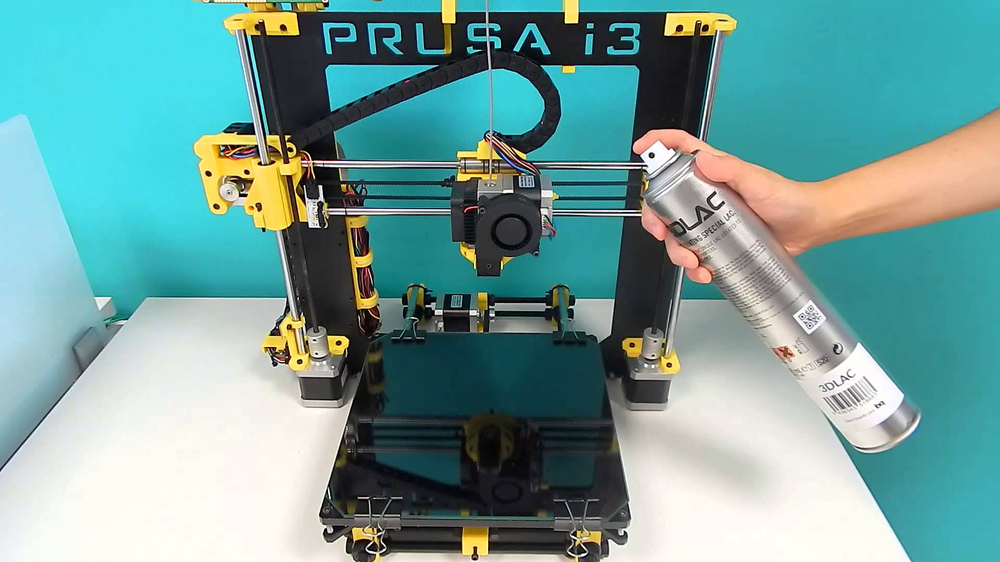

# SOFTWARE Y RECURSOS PARA IMPRESORAS 3D ([191813GE029](https://www.juntadeandalucia.es/educacion/secretariavirtual/consultaCEP/actividad/191813GE029/))

## CEP de Guadix

### José Antonio Vacas @javacasm

## https://github.com/javacasm/3DGuadix2ed

# Open Source

## Movimiento Open Source

## Licencias

#### ¿Qué significa CC?
#####  Licencias
#####  ¿por qué?
#####  ¿Compartir?

### ¿Por qué me gusta esta forma de funcionar?

#### Porque puedo hacer las cosas por mi mismo, cuando las entiendo, las puedo modificar y adaptarlas

### Ejemplo: [Arduino](http://www.arduino.cc)

### Ejemplo: impresoras 3D
Imágenes, diseños, electrónica, programas

[¿Por qué usar Open Source en educación?](http://www.slideshare.net/josepujolperez/programacion-y-robtica-secundaria-open-source?next_slideshow=1)

[Más sobre el tema](https://github.com/javacasm/ILoveOpen/blob/master/contenidos.md)

## Recursos libres

## [Coursera](https://es.coursera.org/)

## [edx](https://www.edx.org/)

## [udacity](https://www.udacity.com/me#!/)

## [miriadax](https://miriadax.net/home)
