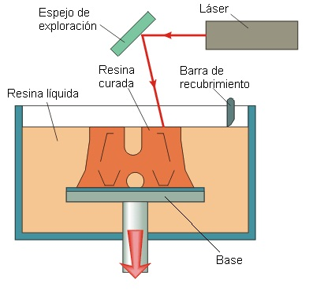

# SOFTWARE Y RECURSOS PARA IMPRESORAS 3D ([191813GE029](https://www.juntadeandalucia.es/educacion/secretariavirtual/consultaCEP/actividad/191813GE029/))

## CEP de Guadix

### José Antonio Vacas @javacasm

## https://github.com/javacasm/3DGuadix2ed

* * *

# Tecnologías

#### Impresoras 3D

##### [Tecnologías](http://tecnologiadelosplasticos.blogspot.com.es/2013/02/impresion-3d.html):

* FDM (FFF): La tecnología FDM estaba protegida por patente y nació una tecnología que en esencia es similar, Fused Filament Fabrication (FFF) que hemos visto en impresoras como RepRap.

* SLA

* SLS

* DLP

## Recursos

[tecnologías](http://www.xataka.com/perifericos/estas-son-las-tecnologias-de-impresion-3d-que-hay-sobre-la-mesa-y-lo-que-puedes-esperar-de-ellas)

[impresión 3d](http://es.wikipedia.org/wiki/Impresi%C3%B3n_3D)

[Tipos de impresoras 3D](http://comohacer.eu/comparativa-impresoras-3d/#Tipos_de_impresion_3D)
